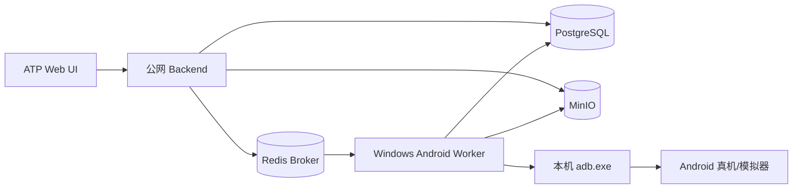

# Windows Android Worker / Agent

ATP 的 Android 执行器会在 Celery Worker 进程所在的机器上调用 `adb`。本方案把
Windows 电脑作为 Android Worker：Android 设备只连接 Windows，公网后端负责调度，
Worker 通过 PostgreSQL、Redis 和 MinIO 的出站连接领取任务并写回执行结果。



## ADB 路径自动发现

Windows 启动脚本和网络诊断脚本会复用同一套 ADB 路径发现逻辑，不要求先修改系统 PATH。支持以下来源，按实际存在的 `adb.exe` 注入当前进程及其子 Worker：

- `ATP_ADB_HOME`：ADB 或 `platform-tools` 目录；
- `ANDROID_HOME` / `ANDROID_SDK_ROOT`：Android SDK 根目录下的 `platform-tools`；
- `%LOCALAPPDATA%\Android\Sdk\platform-tools`；
- `%LOCALAPPDATA%\ATP\tools\platform-tools`。

如果路径来自启动档案，使用 `windows-android-worker.ps1 up -EnvFile <profile>`；脚本会在加载档案后重新发现 ADB。路径发现成功只代表 `adb.exe` 可执行，仍需 `adb devices` 显示 `device` 才能执行 Android 用例。

## 队列和执行范围

- `android`：普通 Android 用例，以及只包含 Android 用例的测试套件/计划。
- `mobile_special`：移动专项任务、ADB 设备扫描、设备租约清理。
- Windows Worker 默认只消费 `android,mobile_special`，并使用 `solo + concurrency=1`，避免多个任务同时操作同一台设备。
- Web/API 用例继续由 `default` Worker 执行。包含 Web/API 与 Android 的混合套件仍由 `default` Worker 运行，不能依赖 Windows Android Worker。
- 执行结果、运行状态、截图/录像和轨迹仍沿用现有 PostgreSQL/MinIO 回传链路，前端不需要新增查看入口。

## 1. 准备 Windows 主机

建议 Windows 10/11、Python 3.12、Android Platform Tools 和 Git。先确认本机命令可用：

```powershell
python --version
adb version
adb devices
```

在项目目录安装后端依赖（Worker 使用项目现有执行器，不要只安装 Celery）：

```powershell
py -3.12 -m venv backend\.venv
backend\.venv\Scripts\python.exe -m pip install -r backend\requirements.txt
```

将 `.env.example` 复制为 `.env`，只在 Windows 主机保存实际值。至少填写与公网后端相同的数据库、Redis、MinIO、`APP_SECRET_KEY` 和 `ENCRYPTION_KEY`；这些值不能提交到 Git。

```powershell
Copy-Item .env.example .env
```

Windows Worker 必须能够连接以下地址：

| 配置 | 用途 |
|---|---|
| `POSTGRES_HOST:POSTGRES_PORT` | 读取任务、设备租约和写回运行状态 |
| `REDIS_HOST:REDIS_PORT` | Celery Broker，领取 Android 任务 |
| `MINIO_HOST:MINIO_PORT` | 上传和读取截图、录像、执行轨迹 |

如果 MinIO 对外暴露的是浏览器访问地址，还要确认 Worker 使用的是 API 端口，而不是 Console 端口。

## 2. 连接 Android 设备

USB 设备直接执行：

```powershell
adb start-server
adb devices
```

无线设备先在同一局域网内完成配对，或者使用已经启用 TCP 调试的设备：

```powershell
adb connect 192.168.1.50:5555
adb devices
```

状态必须是 `device`，不能是 `offline` 或 `unauthorized`。项目自带诊断脚本也可以检查网络设备：

```powershell
powershell -ExecutionPolicy Bypass -File .\scripts\android-network-doctor.ps1 -Target 192.168.1.50:5555
```

## 3. 启动 Windows Worker

先执行诊断：

```powershell
powershell -ExecutionPolicy Bypass -File .\scripts\windows-android-worker.ps1 doctor
```

`up`/`restart` 会先自动执行一次 doctor；PostgreSQL、Redis、MinIO、Python/Celery 或 ADB 不可用时会阻止启动并打印修复提示。没有连接 Android 设备只显示 warning，不阻止 Worker 启动，方便先启动 Agent 再插入设备。

启动、查看状态、查看日志和停止：

```powershell
powershell -ExecutionPolicy Bypass -File .\scripts\windows-android-worker.ps1 up
powershell -ExecutionPolicy Bypass -File .\scripts\windows-android-worker.ps1 status
powershell -ExecutionPolicy Bypass -File .\scripts\windows-android-worker.ps1 logs -Tail 200
powershell -ExecutionPolicy Bypass -File .\scripts\windows-android-worker.ps1 down
```

脚本会在 `.local-run/` 保存 PID 和日志。它不会启动 Celery Beat；整个 ATP 部署只保留一个 Beat，通常运行在公网后端主机。启动时脚本会为当前机器注入稳定的 `ANDROID_WORKER_ID`，Worker 会按 `ANDROID_WORKER_HEARTBEAT_SECONDS` 刷新 Redis TTL 心跳。
设备管理页的 Android Worker 状态来自 `GET /api/v1/devices/workers`；停止进程后记录会在 `ANDROID_WORKER_TTL_SECONDS` 内自动过期。普通 Linux Worker 不配置 `ANDROID_WORKER_ID`，不会出现在这里。

当后端配置 `ADB_SCAN_MODE=worker` 时，设备管理页面的“扫描设备”会把扫描任务投递到
`mobile_special` 队列，接口先返回 `queued` 和扫描任务 ID；前端随后轮询
`GET /api/v1/devices/scan/{scan_id}`，直到 Windows Worker 将 ADB 结果写回 PostgreSQL。
因此页面不会再把投递成功误报为扫描完成；Worker 未启动、任务失败或查询 Redis 结果后端异常时会显示对应错误。

## 4. 公网后端 Worker 队列配置

为了避免 Linux Worker 抢走需要本机 ADB 的任务，公网后端的普通 Worker 需要排除 `android,mobile_special`：

```dotenv
CELERY_QUEUES=default,ios,ai,maintenance,performance
ADB_SCAN_MODE=worker
```

Windows 主机的脚本会强制使用：

```dotenv
CELERY_QUEUES=android,mobile_special
```

修改后重启公网 Worker，并确认 Beat 仍在运行。若部署环境只有一个共享 Worker，不能保证 Android 任务落到 Windows 主机。

## 5. 验收流程

1. 在 Windows 执行 `adb devices`，确认目标设备状态为 `device`。
2. 执行 `windows-android-worker.ps1 doctor`，确认 PostgreSQL、Redis、MinIO 和 ADB 检查通过。
3. 在 ATP 中触发一个 Android 用例。
4. 查看 Windows Worker 日志，应出现 `android` 队列任务和对应的 `adb` 执行日志。
5. 在运行详情查看状态、步骤结果和 MinIO 证据。
6. 停止 Windows Worker 后再次触发，运行应保持 pending，恢复 Worker 后继续消费；不要让 Linux Worker 同时监听 Android 队列。

## 安全要求

- 不要把 ADB 5037 端口或设备 5555 端口暴露到公网；Windows Worker 应通过出站连接访问受保护的服务端点。
- PostgreSQL、Redis、MinIO 优先放在 VPN/专网中；若必须跨公网，使用防火墙白名单、强密码和 TLS/VPN，不要使用示例密码。
- Windows `.env` 包含数据库、对象存储和加密密钥，按机密文件保护，不要上传仓库或发送到群聊。
- 一个 Windows Worker 建议只绑定一个执行账号/工作目录；多台 Windows 主机使用独立虚拟环境和独立日志目录。
