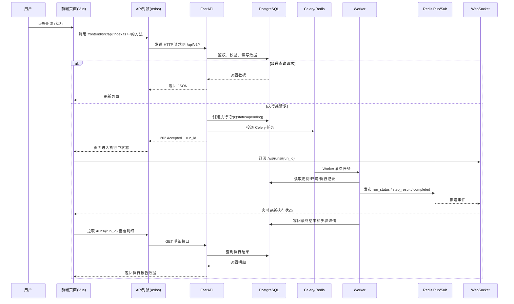

# 前端到后端再到 Worker 的调用链

本文用于说明 ATP 在“用户从前端发起请求”到“后端处理并交给 Worker 执行”的完整链路，重点覆盖三类常见路径：

- 普通查询请求
- 执行类请求（如运行用例 / 套件 / 计划）
- 实时状态回传（WebSocket + Redis Pub/Sub）

## 1. 核心组件

- 前端页面：Vue 3 页面与交互逻辑，负责触发查询、运行和展示结果
- 前端 API 层：`frontend/src/api/http.ts` 基于 Axios 封装统一请求入口，`frontend/src/api/index.ts` 按领域导出接口
- 后端 API 层：`backend/app/main.py` 创建 FastAPI 应用，`backend/app/api/v1/router.py` 聚合各业务路由
- 数据层：PostgreSQL + SQLAlchemy Async，负责持久化用例、执行记录、步骤结果等
- 任务队列：Celery + Redis，负责异步执行耗时任务
- Worker：`backend/app/worker/tasks.py` 根据用例类型分发到不同执行器
- 实时推送：Worker 将执行事件发布到 Redis，FastAPI WebSocket 订阅后推送给前端

## 2. 总览调用链

## 3. 普通查询请求链路

以“前端加载列表数据”为例：

1. 页面调用 `frontend/src/api/index.ts` 中的接口方法
2. 接口方法通过 `frontend/src/api/http.ts` 发起请求，统一使用 `/api/v1` 作为 `baseURL`
3. 浏览器 Axios 使用 HttpOnly Cookie 会话并携带 `X-Requested-With`；CLI/API 客户端仍可使用 `Authorization: Bearer <token>`
4. FastAPI 路由接收请求，完成鉴权、参数校验、数据库查询
5. 后端返回 JSON，前端拿到数据后渲染表格、详情或统计图

这类请求一般不会进入 Worker，典型例子包括：

- 查询项目、模块、用例列表
- 查询环境变量、通知配置、统计数据
- 查询某次执行记录详情

## 4. 执行类请求链路

以“运行单个测试用例”为例，这是最典型的“前端 -> 后端 -> Worker”调用路径。

### 4.1 前端发起执行

- 页面调用 `caseApi.run(id, data)`
- 该方法最终发送 `POST /api/v1/cases/{id}/run`

对应前端入口：

- `frontend/src/api/index.ts`
- `frontend/src/api/http.ts`

### 4.2 后端创建执行记录并投递任务

后端在 `backend/app/api/v1/cases.py` 中处理该请求：

1. 校验当前用例是否存在
2. 如传入 `env_id`，则读取环境变量并与 `extra_vars` 合并
3. 创建一条 `TestRun` 记录，初始状态为 `pending`
4. 调用 `run_test_case.delay(run.id, merged_vars)` 投递 Celery 异步任务
5. 立即返回 `202 Accepted` 和当前执行记录

这样做的目的，是让前端快速收到响应，避免 Web / Android / 长链路接口测试阻塞 HTTP 请求线程。

### 4.3 Worker 执行实际任务

Celery Worker 收到任务后，进入 `backend/app/worker/tasks.py`：

1. 根据 `run_id` 读取 `TestRun` 和 `TestCase`
2. 将执行状态更新为 `running`
3. 根据 `case_type` 路由到不同执行器，例如：
   - API：`run_api_case`
   - GraphQL：`run_graphql_case`
   - WebSocket：`run_websocket_case`
   - gRPC：`run_grpc_case`
   - Web：`run_web_case` 或 `run_web_lowcode`
   - Android：`run_android_case` 或 `run_android_lowcode`
4. 执行过程中持续写入数据库，并发布进度事件
5. 完成后更新最终状态，如 `passed`、`failed`、`error`

### 4.4 API 用例的可选登录态复用

API 用例配置中的 `reuse_api_session` 用于控制 Cookie 登录态是否复用，默认值为 `false`：

- 开启后，同一项目中同样开启该选项的 API 用例共享项目级 Cookie 会话；
- 会话以加密后的形式保存到 Redis，默认 TTL 为 8 小时，不同项目之间不会互相复用；
- 关闭后，每个 API 用例按原有方式创建独立 HTTP 客户端，不读取或写入项目会话；
- Bearer 等接口 Token 仍通过用例步骤中的提取变量和认证配置传递，不会因为开启 Cookie 复用而自动共享。

前端在 API 用例编辑抽屉中勾选“复用项目 API 登录态”即可启用。通常应在登录步骤所在用例和需要登录的后续用例中同时开启该选项。

## 5. 实时状态回传链路

单纯依赖前端轮询会比较慢，所以当前项目还提供了 WebSocket 实时回传机制。

### 5.1 Worker 发布执行事件

Worker 通过 `backend/app/core/redis_client.py` 中的 `publish_run_event()`，把事件发送到 Redis Channel：

- Channel 格式：`atp:run:{run_id}`
- 常见事件类型：
  - `run_status`
  - `step_result`
  - `completed`

### 5.2 FastAPI WebSocket 转发事件

后端在 `backend/app/api/v1/ws.py` 中暴露 WebSocket 端点：

- 路径：`/ws/runs/{run_id}`

处理流程如下：

1. 优先校验 WebSocket 的 HttpOnly access Cookie；为兼容旧的非浏览器集成暂时回退查询参数令牌
2. 检查当前用户是否有权限订阅该 `run_id`
3. 连接 Redis Pub/Sub，并订阅 `atp:run:{run_id}`
4. 一旦 Redis 收到消息，就立刻转发到 WebSocket 客户端
5. 当前端收到 `completed` 事件后，可以关闭订阅或切换到结果页

## 6. 套件与计划的调用链差异

除了单用例执行，项目里还有两类类似链路：

- 套件执行：后端投递 `run_test_suite.delay(...)`
- 计划执行：后端投递 `run_test_plan.delay(...)`

它们与单用例执行的共同点是：

- 都由 FastAPI 接收 HTTP 请求
- 都会先写入数据库中的“运行记录”
- 都通过 Celery 异步执行
- 都可通过 Redis / WebSocket 回传实时状态

不同点在于 Worker 内部编排粒度不同：

- 单用例执行关注一个 `TestCase`
- 套件执行会顺序执行多个用例
- 计划执行会按计划配置触发套件或用例集合

## 7. 为什么项目采用这种分层

这种链路设计的主要收益是：

- 前端响应快：提交执行请求后，后端立即返回，不必等待耗时任务完成
- 执行能力可扩展：Worker 可以独立扩容，适合跑 Web、Android、接口等不同任务
- 实时体验更好：通过 Redis + WebSocket 推送进度，而不是只靠轮询
- 结构更清晰：HTTP 请求处理、任务执行、状态推送分别落在不同模块，便于维护

## 8. 关键文件速查

- 前端请求封装：`frontend/src/api/http.ts`
- 前端业务接口：`frontend/src/api/index.ts`
- FastAPI 入口：`backend/app/main.py`
- API 路由聚合：`backend/app/api/v1/router.py`
- 单用例执行入口：`backend/app/api/v1/cases.py`
- WebSocket 推送：`backend/app/api/v1/ws.py`
- Redis 事件发布：`backend/app/core/redis_client.py`
- Celery 配置：`backend/app/worker/celery_app.py`
- Worker 任务入口：`backend/app/worker/tasks.py`

## 9. 一句话总结

可以把整条链路理解为：前端通过 Axios 调 FastAPI，FastAPI 负责鉴权与落库，耗时执行交给 Celery Worker，Worker 再通过 Redis + WebSocket 把执行进度实时推回前端。
