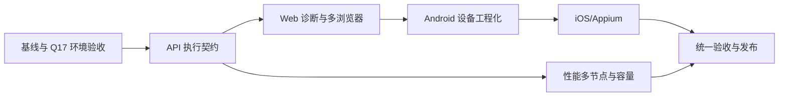

# Q18 测试平台能力扩展开发计划

> 最新状态与前后实现对比：[`docs/q18-latest-status-2026-08-07.md`](./q18-latest-status-2026-08-07.md)。本计划中的“已实现”仍需结合该文件区分代码完成与真实环境验收。

> 版本：2026-08-11

> 2026-08-12 计划同步：Q18 新增代码主链已完成，后续执行顺序和验收边界统一维护在 [`docs/next-development-plan-2026-08-12.md`](next-development-plan-2026-08-12.md)。本轮从 Windows 真实 Android 设备验收入口开始，未连接真实设备时不得生成通过证据。

> 2026-08-12 阶段推进：Linux/Kubernetes 性能验收入口已增加 Prometheus readiness/PromQL 检查和 URL 凭据安全校验；真实集群仍需独立执行并留存证据。

> 2026-08-12 Web 阶段推进：独立录制 Worker 增加基于 Redis 心跳的健康标记，并同步 Compose/Helm 探针；真实 Linux/Xvfb、多浏览器和跨副本录制仍需执行验收。

> 2026-08-12 浏览器证据推进：矩阵 smoke 支持显式生成 Trace/HAR 和 Console/网络失败摘要，默认保持轻量模式；真实 Worker 路由和跨副本 E2E 仍需目标环境。

> 2026-08-12 iOS 阶段推进：新增 Appium status/session smoke 与脱敏附件报告，真实 macOS/XCUITest/WDA/设备仍需目标环境执行。
> 目标：在现有 API、Web、Android 和性能测试基础上，补齐可持续使用的企业级测试能力。
> 当前状态：API P0 主链、Web 多浏览器/诊断主链、Android 设备租约主链、iOS/Appium 本地执行边界和性能增强代码已实现；Windows 是日常开发主线，Linux/Kubernetes、真实设备、性能节点与外部服务属于目标环境开发/验收。

## 1. 现状与目标

当前平台已经具备以下主干能力：

- API：HTTP/HTTPS、REST、GraphQL、WebSocket、gRPC、断言、JSONPath 提取、环境变量、数据集、Mock。
- Web：Playwright、Chromium、录制、低代码步骤、截图、录像、失败诊断。
- Android：ADB/uiautomator、低代码、APK 管理、截图、稳定性专项、Crash/ANR/logcat 分析。
- 性能：k6、Locust、gRPC、阶段压测、性能节点、资源采样、基线和阈值门禁。

主要缺口集中在：

- API 的 SSE、Cookie 独立配置、multipart 文件上传、XML/XPath、JSON Schema、前后置脚本、契约测试。
- Web 的多浏览器、网络与 Console 日志、Trace、元素库、POM、视觉回归和可控定位器修复。
- 移动端的 iOS/Appium、设备租约、录屏、弱网/权限/旋转/系统事件和兼容性矩阵。
- 性能测试的单次运行多节点分片、容量自动探测、JMeter 和专用告警闭环。

本计划的目标不是一次性堆叠功能，而是先补齐执行契约，再补 UI，最后用真实环境和回归测试收口。

## 2. 推进原则

1. 先定义请求、步骤、结果和附件的数据契约，再实现前端入口。
2. 所有新增能力必须有后端行为测试；涉及 UI 的能力必须有组件或 E2E 验收。
3. 脚本、表达式、上传文件和外部工具执行都必须经过大小、超时、路径、权限和资源限制。
4. 兼容旧用例：旧配置可以继续执行，新字段使用可选字段和安全默认值。
5. 每个阶段都同步更新 [能力基线矩阵](./capability-baseline-2026-08-07.md)，避免“代码存在但用户无法使用”或“界面显示已支持但执行器不支持”。

## 3. 阶段计划

### Phase 0：基线与发布收口（P0）

目标：固定当前能力基线，避免后续开发失去对比依据。

任务：

- [ ] 完成 Q17-04：Linux/Kubernetes 专用性能 Worker、真实 Locust/gRPC/TLS 目标和资源采样验收。
- [ ] 将真实环境结果补充到 `docs/performance-executor-evaluation.md` 和部署 Runbook。
- [x] 以本文档和能力矩阵作为 Q18 唯一进度入口。
- [x] 为 API 请求文件、Web 视频和 Trace 建立统一对象存储命名规则，并在结果摘要中关联附件。
- [x] AI 模型配置增加独立的 `openai_compatible` 三方协议，支持 `/models` 发现和 `/chat/completions` 调用；Endpoint 必填，真实服务联调单独留作环境验收。

验收标准：

- 本地质量门禁通过，且外部环境阻塞项被明确记录，不把未联调能力标记为完成。
- 能力矩阵中的每一项都有源码入口、测试入口或明确的未实现说明。

### Phase 1：API 测试增强（P0）

#### 1.1 请求能力

- [x] 增加 Cookie 独立编辑器，支持静态 Cookie、变量引用和 API 会话复用二选一/组合策略。
- [x] 增加 multipart/form-data 文件字段，支持 MinIO 文件引用、文本字段、文件名和 MIME 类型。
- [x] 增加 XML 请求体类型，并统一 Content-Type、编码和原始文本展示。
- [x] 增加 SSE 执行器：连接、请求头、事件等待、事件类型/数据断言、超时和主动关闭。
- [x] 扩展 API gRPC 执行器：根据 Proto 方法声明支持 Unary、Server Streaming、Client Streaming 和 Bidi Streaming，统一响应、提取和断言结果；真实服务联调仍按环境验收。
- [x] gRPC 用例编辑器支持从本地选择 `.proto` 文件读取到编辑器，浏览器端校验扩展名、空内容和 1MB 大小上限，不把协议源码误上传为请求文件。
- [x] gRPC 用例支持主 Proto 与 import 文件分开选择，执行器在临时目录重建安全的多文件包，限制 64 个文件/8MB，并拒绝绝对路径和 `..` 路径。

#### 1.2 断言与变量

- [x] 增加 JSON Schema 响应断言，支持内联 Schema、项目级 Schema 资产保存/复用、错误路径和兼容旧断言。
- [x] 增加 XML 解析和 XPath 提取/断言。
- [x] 增加受限表达式断言，禁止任意 Python 执行；明确类型转换、空值和错误处理规则。
- [x] 统一 HTTP、GraphQL、WebSocket、gRPC 的变量提取和断言结果格式。

#### 1.2.1 高级认证

- [x] API/GraphQL 支持 Digest 认证，使用 httpx challenge 交互，不把认证对象写入执行证据。
- [x] API/GraphQL 支持 OAuth2 Client Credentials，支持 `client_secret_basic` / `client_secret_post`、scope、audience、变量渲染和单场景 token 缓存；非法认证方式、缺少 token 字段和非 JSON 响应明确失败。

#### 1.3 脚本与场景

- [x] 设计安全的 API 前置/后置动作契约，第一版仅开放白名单动作，不执行 Python/JavaScript；动作数量和变量名均受限。
- [x] 支持数据集的顺序、随机、固定次数和受控组合策略，并对组合上限和输入摘要做脱敏处理；数据集管理页新增 AI 合成数据草稿入口，结果不直接落库，仍经 Schema 校验和版本保存。
- [x] 增加 API 用例运行级 `dataset_prepare_actions`：受限 HTTP seed、变量设置/删除、状态/响应断言和响应提取在 child run 创建前执行一次；不执行任意脚本，真实 seed 服务和 MinIO 集群仍需环境验收。
- [x] Mock 管理页新增 AI Mock 规则草稿入口：可按要求或参考现有规则生成，结果先预览编辑，确认后复用普通创建接口保存；原有 AI 用例生成入口保持独立。
- [x] 强化 API 场景编排：编辑器展示多步骤依赖并支持追加步骤；执行器支持依赖跳过、失败策略、上下文变量作用域和登录态生命周期。

#### 1.4 导入与契约

- [x] 将当前 AI 解析能力扩展为直接导入：OpenAPI 3、Swagger 2、Postman Collection v2.1；解析结果支持在用例界面直接导入可执行 API 用例。
- [x] 导入时转换请求、认证、环境变量、示例响应和断言，并提供预览、冲突处理和回滚。
- [x] 增加契约测试：响应 Schema 校验、版本差异、必填字段删除/类型变化/状态码变化报告。
- [x] 将契约比较升级为项目级 Provider/Consumer 资产：支持 CRUD、版本递增、角色区分、项目隔离和保存资产间比较；OpenAPI/Swagger 支持项目内 JSON Pointer `$ref` 展开，外部引用默认只告警且不联网拉取，并支持发布安全模式拒绝外部引用。
- [x] 增加契约资产管理 UI：按项目查看 Provider/Consumer 资产，支持角色筛选、JSON 定义校验、版本摘要、编辑删除及基线/当前版本比较。

验收标准：

- API 行为测试覆盖 SSE、multipart、Cookie、XML/XPath、JSON Schema、OAuth2/Digest 高级认证和脚本沙箱的成功/失败/超时路径。
- OpenAPI/Postman 导入可以生成可执行用例，且导入失败不会产生半成品数据。
- 同一 API 场景可以验证登录、提取 Token、后续请求复用 Token 的完整链路。

### Phase 2：Web UI 测试增强（P0/P1）

#### 2.1 浏览器与诊断

- [x] 将浏览器从 Chromium 扩展到 Chromium、Firefox、WebKit，并在录制、低代码、脚本三种模式中统一配置。
- [x] 增加 Playwright Trace 采集、下载和报告展示入口数据。
- [x] 采集 Console、页面错误、请求/响应、失败请求和关键网络时间线。
- [x] 支持按浏览器、分辨率、设备配置并行执行，并在报告中展示矩阵结果；本机 Chromium/Firefox/WebKit 页面烟测已通过，真实 Firefox/WebKit Worker 仍待验收。

#### 2.2 页面资产与步骤

- [x] 建立项目级元素库：名称、定位器、备用定位器、页面、版本、维护人和失效记录。已完成资产模型、项目级 CRUD、版本递增、失效记录、低代码步骤引用、备用定位器回退和绑定项目录制自动写入。
- [x] 建立页面对象模型：页面对象、元素引用、公共操作和低代码步骤引用关系，并接入低代码步骤执行。
- [x] 录制结果在绑定项目时默认写入元素库，并将步骤回填为 `element_asset_id` 可选引用，避免每个用例重复录入定位器。
- [x] 增加文件上传、下载等待、下载文件校验和附件关联步骤。
- [x] Web/Android 低代码支持生成可编辑的 Python 脚本；Web 生成器覆盖文件上传/下载、视觉断言、元素资产和页面对象展开，缺失定位器或未知动作显式失败，不静默丢步骤。

#### 2.3 视觉与定位器辅助

- [x] 增加截图基线、像素差异、忽略区域、阈值和视觉回归报告。
- [x] 将当前 AI 失败诊断扩展为“候选定位器建议 → 用户确认 → 生成变更 → 回归验证”；默认不自动改写生产用例。

验收标准：

- 同一个 Web 用例至少可在 Chromium、Firefox、WebKit 中执行，并能区分浏览器失败原因。
- 失败报告可同时看到步骤、截图、Trace、Console 和网络摘要。
- 上传/下载、视觉差异和定位器修复建议均有可重复的 E2E 回归用例。

### Phase 3：移动端测试增强（P1）

#### 3.1 Android 工程化

- [x] 增加设备租约、占用锁、心跳、释放和异常回收，避免并发任务抢占同一设备（`device_leases`、移动 Worker 自动占用/释放、每分钟过期回收）。
- [x] 增加标准安装、卸载、清理数据、版本选择和应用启动前置步骤；专项任务界面可配置，执行前按顺序应用，执行后可卸载清理。
- [x] 增加标准录屏、logcat、设备信息和系统日志附件；录屏和产物采集受资源上限保护。
- [x] 增加弱网、权限、旋转、后台/前台和可控系统动作步骤；来电等外部系统事件仍待设备环境。
- [~] 增加设备/系统版本/分辨率兼容性矩阵、隔离子运行汇总和基于独立数据库会话/租约的并行调度；真实设备池并发抢占、故障恢复仍待验收。

#### 3.2 iOS/Appium

- [x] 增加 `ios` 设备和应用资产模型，支持 UDID、平台版本、IPA、Bundle ID 和签名信息；资产 API 受项目权限和 IPA 类型/大小限制。
- [~] 增加 macOS Appium/XCUITest Worker、专用 Celery 队列、心跳和设备租约；W3C Appium Worker、`ios` 队列、租约心跳/回收已完成，真实 macOS/XCUITest 环境仍待验收。
- [x] 接入 iOS 脚本模式、低代码步骤、截图、录屏、日志和统一报告；真实设备能力仍按环境验收执行。
- [ ] 通过真实 iPhone、iOS Simulator 和签名应用完成外部环境验收。

验收标准：

- Android 设备并发执行不会出现同一设备双重占用。
- Android 和 iOS 用例在统一报告中都具备步骤、截图、日志、设备和应用版本信息。
- iOS 能够完成最小闭环：安装/启动 → 点击/输入 → 断言 → 截图/日志 → 结果回传。

### Phase 4：性能测试增强（P1）

- [x] 将性能节点从“单次运行绑定一个节点”扩展为单次测试多节点分片、采样和结果聚合。
- [x] 增加节点标签、地域、网络出口、执行器和容量的选择策略。
- [x] 增加容量测试分析：按已选运行记录排序，识别最大稳定负载、错误率/P95 瓶颈并生成容量报告；自动阶梯生成与边界限制已接入，真实节点验收仍待完成。
- [x] 增加性能专项通知：阈值失败、基线回归、节点异常和资源采样异常汇总后复用项目通知渠道；真实渠道联调仍待验收。
- [x] 增加 JMeter 执行器、JTL 结果解析和可选 HTML 报告附件；保持 k6、Locust、gRPC 统一摘要契约。
- [x] 增加目标服务指标接入边界，区分 Worker 本机指标、平台依赖指标和目标服务指标；Windows 本地 Prometheus 与真实 k6 run 已完成闭环验收，生产 Prometheus/外部目标联调仍待验收。

验收标准：

- 一次压测可以在多个节点执行并正确合并请求数、延迟、错误率和资源样本。
- 容量报告可以说明最大稳定并发、P95/P99、错误率和资源瓶颈，而不是只有一组统计值。
- k6、Locust、gRPC、JMeter 的执行状态、取消、原始结果、摘要和阈值门禁格式一致。

### Phase 5：统一验收与文档收口（P0）

- [x] 更新能力矩阵中的当前状态、实现入口、测试入口和验收证据。
- [x] 更新开发计划、前后实现对比、实施日志、记忆和操作入口说明；外部 Runbook 仍按环境验收补证据。
- [x] 完成后端回归、前端 type-check/build、前端 Vitest、Playwright E2E、迁移检查、Bandit、pip-audit、npm audit 和静态质量门禁；E2E 使用 mock API 的边界已记录，真实 API 联调仍属于外部验收。
- [ ] 对真实设备、真实性能节点和外部目标服务保留带日期的验收证据。
- [x] 在 `Task.md` 和 Q18 文档中记录已完成项、外部阻塞项和下一阶段计划。

## 4. 推荐顺序

优先级建议：

1. P0：API 文件上传、Cookie、JSON Schema/XPath、SSE、直接导入和契约测试。
2. P0/P1：Web Trace、网络/Console 日志、多浏览器和元素资产管理；录制会话 Redis 控制面、独立 Worker、Windows 托管及 Compose/Helm 部署入口已补齐，保留 Linux/Xvfb 和跨副本真实验收。
3. P1：Android 设备租约与日志/录屏，再接入 iOS/Appium。
4. P1：性能多节点分片、容量测试和专用告警，再接入 JMeter。

## 5. 2026-08-10 下一阶段执行计划

当前 Q18 的新增代码主链已完成，后续分为 Windows 本地使用完善和目标环境验收两条线；Windows 本地项优先提升开发效率，目标环境项负责发布可信度。

截至 2026-08-12，Windows 根 `.env` 的 `local-all` 已按当前目标使用远程基础设施地址；启动配置页面和外部基础设施文档已去除特定环境的用户名、管理员账号和明文密码。独立性能 Agent 的历史验收配置仍需与目标环境重新对齐后才能复用，不能把历史 163 主机证据当作当前 172 主线证据。

### Windows 本地使用主线

- [x] 增加 `scripts/windows-local.ps1` 启动前预检：`.env`、Python/Node/Playwright、8000/5173 端口，以及 PostgreSQL/Redis/MinIO 连通性。
- [x] 增加 Windows 性能依赖检测和说明：k6、Locust、grpcio/grpcio-tools；需要 JMeter 时明确 Java/JMeter 5.6.3 安装和 `PERFORMANCE_EXECUTORS` 配置。
- [x] 增加 PowerShell 版 Android 网络诊断，减少对 Git Bash/WSL 的依赖。
- [~] 固化并自动执行 Windows 全量本地冒烟：`scripts/windows-local-smoke.ps1` 已覆盖服务预检、真实管理员登录、认证读接口、API 健康、Web 登录页、Playwright mock E2E、Chromium/Firefox/WebKit 页面矩阵、临时文件上传/清理、HTML/JUnit 报告生成和可选停止服务，并生成脱敏 JSON 报告；支持 `-WebCaseId` 复用已有用例、`-EnvFile` 对齐实际启动档案，也支持显式 `-SeedWebDownloadCase` 创建/执行/清理临时下载用例，仓库已提供 `atp-windows-download.html` 手工夹具，seed 模式已在当前 Windows 环境使用 `remote-infra.env` 完成真实 Worker/MinIO 对象验收；新增 `scripts/package-performance-acceptance.ps1` 生成不含密钥的性能验收 bundle、逐文件清单和 SHA-256 校验；启动档案和底层 `-EnvFile` 均会把配置只注入新子进程，Android Agent `up/restart` 会先执行 doctor；复用已有用例和 Android 扫描仍需继续留证。
- [x] 明确 Windows Worker 使用 `--pool=solo` 只用于开发联调，不作为生产并发性能结论。

### 目标环境开发/验收主线

1. **Q17-04 性能隔离栈**：在 Linux/Kubernetes 启动专用 Worker，完成 Locust/gRPC/TLS、JMeter、取消、节点 allowlist 和资源采样 smoke；产出 JSON/JTL/运行摘要证据。
2. **真实 API 联调**：使用 Provider/Consumer 的真实规格验证契约资产版本比较、外部 `$ref` `warn/reject` 策略，并在真实 OAuth2 Token Endpoint、Digest 服务上验证高级认证交互。
3. **Web Worker 验收**：在容器 Worker 上验证 Firefox/WebKit、Trace、网络/Console、文件上传下载、视觉基线和定位器修复建议。
4. **移动端验收**：先完成 Android 设备池并发/矩阵/录屏/系统动作，再在 macOS 上完成 Appium/XCUITest、签名 IPA 和 iOS 最小闭环。
5. **观测与发布收口**：Windows 本地已验证 Prometheus 目标指标采样与性能 run 关联；下一步接入真实生产 Prometheus 与邮件/企业微信/钉钉渠道，归档性能基线、阈值回归和通知证据，并同步发布 Runbook。

完成标准：每个外部任务均有环境、日期、命令、结果摘要和附件；在证据齐全前，能力矩阵继续标记为“部分实现/待环境验收”。

## 6. 进度维护规则

- 代码完成但未联调：标记为“已实现，待环境验收”，不能直接标记为完成。
- UI 完成但执行器不支持：标记为“部分支持”，并补充阻塞原因。
- 每个完成项至少记录一个测试文件、一个运行命令或一份外部验收证据。
- 删除或降级能力时，保留原状态、原因和迁移说明，避免历史矩阵失真。
